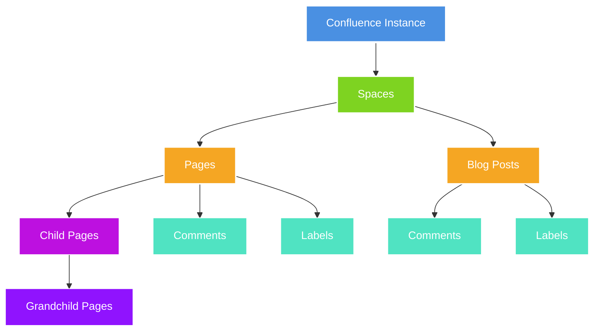

# Confluence MCP Server
Confluence organizes content in a hierarchical structure that enables efficient knowledge management and collaboration:

- **Spaces**: Top-level containers that organize related content
- **Pages**: Wiki-style documents that can have parent-child relationships
- **Blog Posts**: Time-based content entries within spaces
- **Comments**: Footer comments for discussion and feedback
- **Labels**: Tags for categorization and searchability
- **Permissions**: Access control at space level



Our MCP server allows interacting with these elements using natural language.

## Core Tools
The MCP server provides diverse tools for
1. Space Management
2. Page Operations
3. Blog Post Management
4. Content Enhancement
5. Navigation & Discovery


## Testing
```
Weilliptic$$$> deploy --widl-file <path to>/confluence.widl --file-path <path to>/confluence.wasm --config-file <path to>/config.yaml
```

### `config.yaml`
```yaml
confluence_url : <base url of your confluence account>
api_key: <API key configured in the confluence account>
email: <email associated with this API key>
```

### Prompt Examples
- Create a page titled 'Large Language Model x' in the space 'My First Space' with the content explaining about Large Language Models and their advantages.
- Get the page content for 'Hello from MCP' in 'My First Space'
- List all pages in the space 'Exhaustive Test Space by MCP'.
- Create a page titled 'Function Calling in LLM x' in the space 'My First Space' with parent page  'Large Language Model x' with the content explaining about Function Calling in Large Language Models.
- Create a blog post titled 'Weekly Update W10' in 'Snowflake Testing' with content 'Sprint status goes here.'
Get the descendants of the page 'Page1' in space 'Snowflake Testing'
- Add a Comment about genesis of LLMs in the page 'Large Language Model x' of space 'My First Space'
- Adds a footer comment to the specified page, enabling discussion and additional context without modifying the main page content. This facilitates collaboration and knowledge sharing through threaded discussions.
